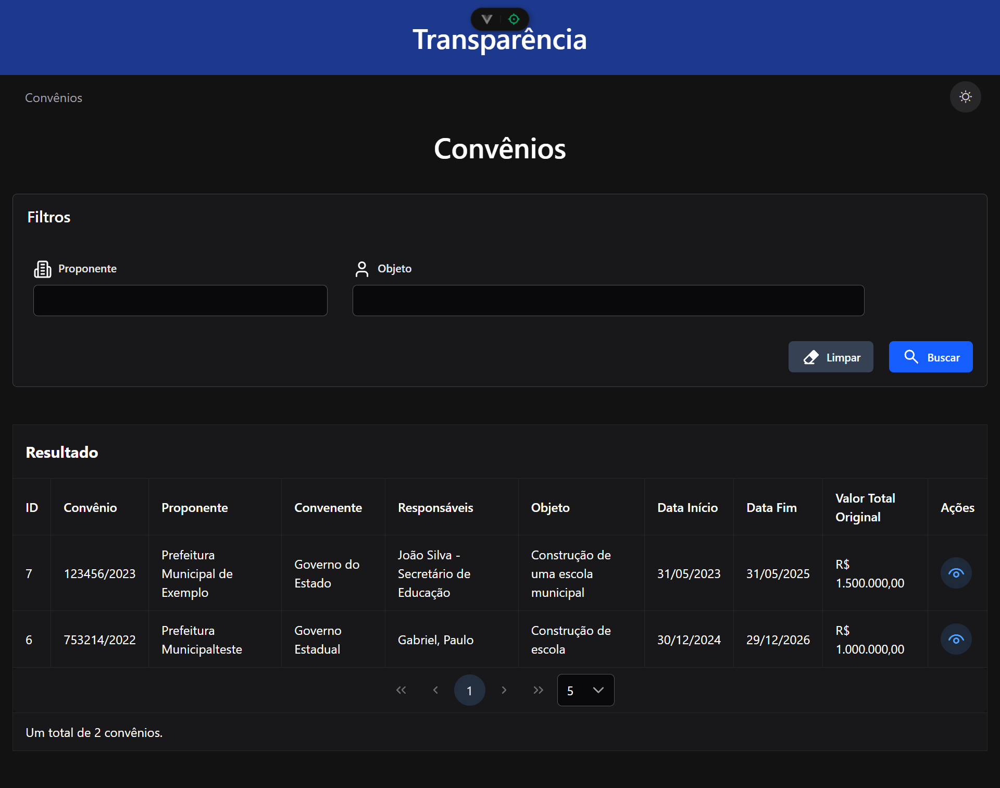
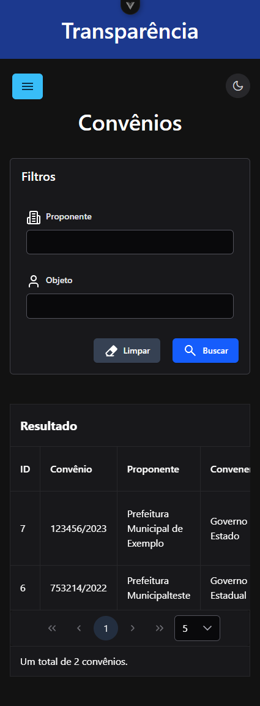
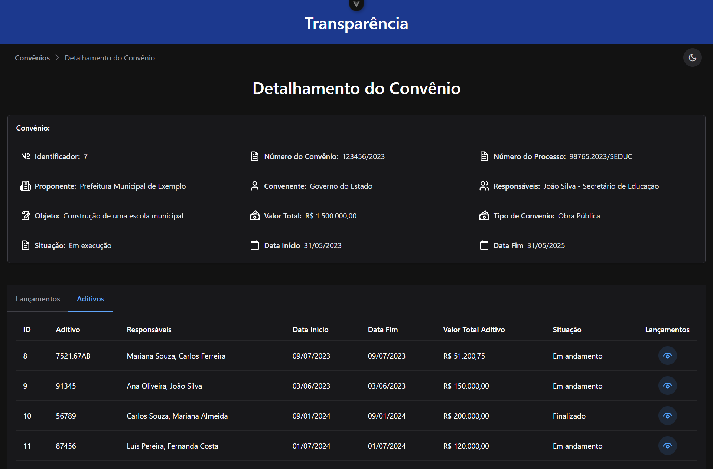
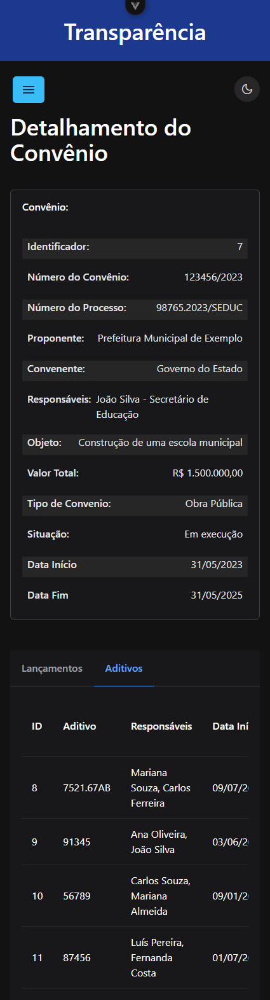

# Sobre o Projeto

## 🎯 Objetivo

Este sistema de transparência pública foi criado para oferecer à sociedade acesso direto e facilitado aos dados de convênios, aditivos e repasses realizados. Ele permite que qualquer cidadão consulte informações importantes com clareza e agilidade.

## 🔎 Sobre este sistema

Esta é a versão **Transparência** do projeto. Seu objetivo é exibir os dados de forma pública e acessível.  
Ela permite realizar buscas por **Proponente** e **Objeto**, sem necessidade de autenticação.

Existe também um sistema complementar chamado **Frontend Gerência**, utilizado por administradores para cadastrar, editar e excluir os dados apresentados aqui.

## ⚙️ Funcionalidades

- Consulta pública de convênios cadastrados
- Filtragem por **Proponente** e **Objeto**
- Visualização de dados detalhados de cada convênio

## 📱 Responsividade

O sistema é totalmente **responsivo**, funcionando perfeitamente em **celulares**, **tablets** e **computadores**.  
A interface foi desenvolvida com o framework **Tailwind CSS**, garantindo uma ótima experiência de uso em diferentes tamanhos de tela.

## 🛠️ Tecnologias Utilizadas

- Vue.js 3 (Composition API)
- PrimeVue
- Tailwind CSS
- Axios
- Vue Router
- Pinia

## 🤝 Compromisso com a Transparência

Este projeto foi idealizado com foco na **transparência** e no **controle social**.  
Ao facilitar o acesso às informações públicas, promovemos uma administração mais aberta e responsável.

---

# 📸 Screenshots do projeto

## 🗂️ Tela inicial convênio

## 📱 Mobile

---

## 📄 Tela de detalhamento do convênio

## 📱 Mobile
